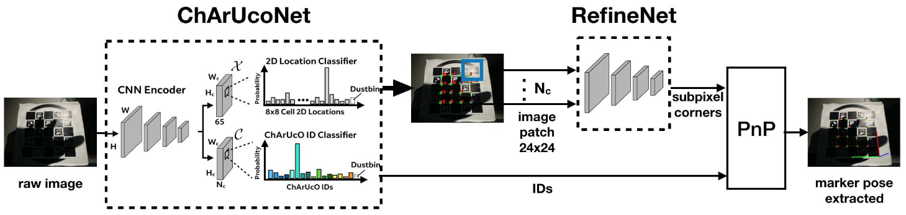

# deep_learning_project
This is our attempt at implementing the Deep ChArUco model from [this paper](https://openaccess.thecvf.com/content_CVPR_2019/papers/Hu_Deep_ChArUco_Dark_ChArUco_Marker_Pose_Estimation_CVPR_2019_paper.pdf).

Currently implemented:
- ChArUcoNet (A CNN model based on the [SuperPoint network](https://openaccess.thecvf.com/content_cvpr_2018_workshops/papers/w9/DeTone_SuperPoint_Self-Supervised_Interest_CVPR_2018_paper.pdf)) with the descriptor head in the SuperPoint network is replaced with a ChArUco ID classification head.
